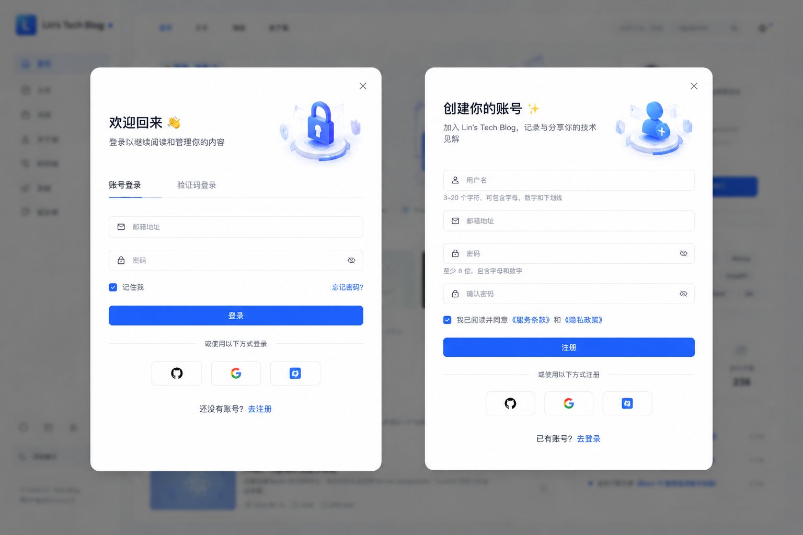
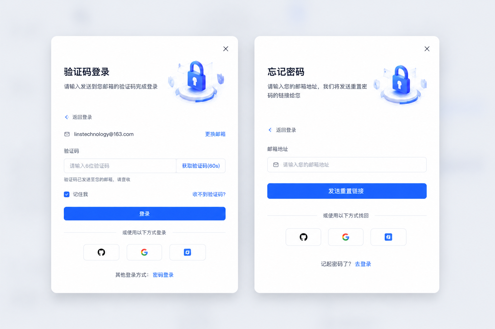
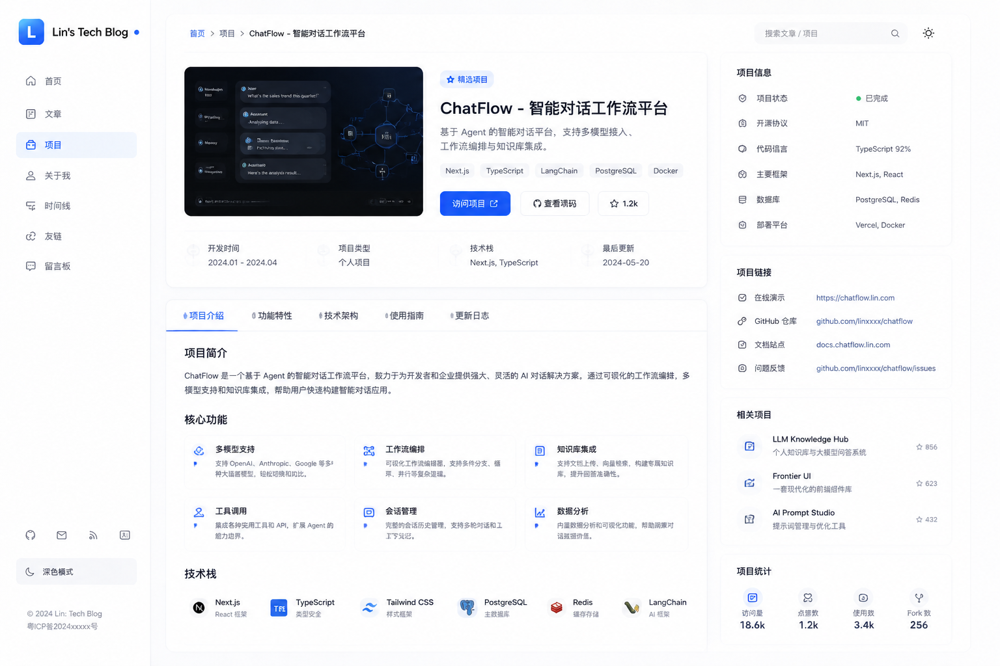
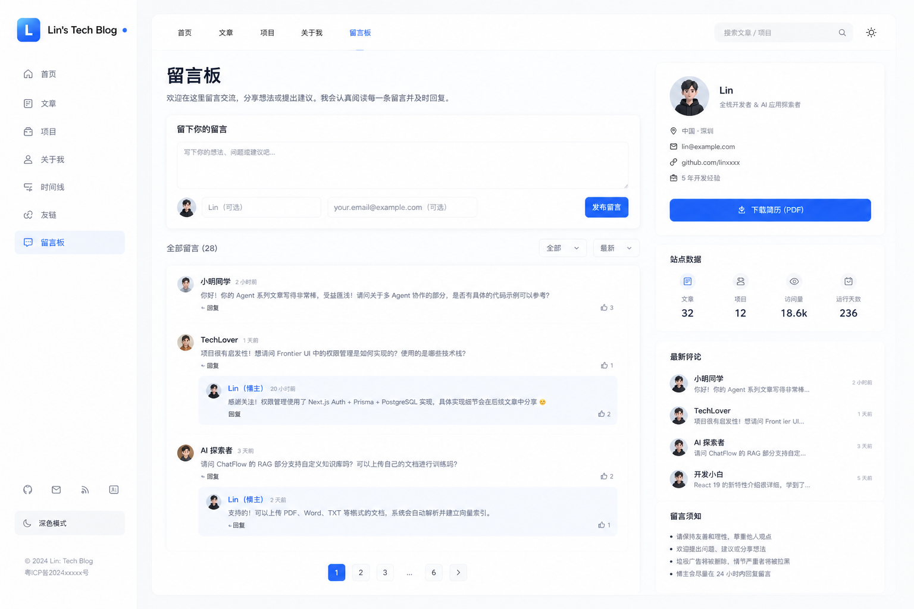
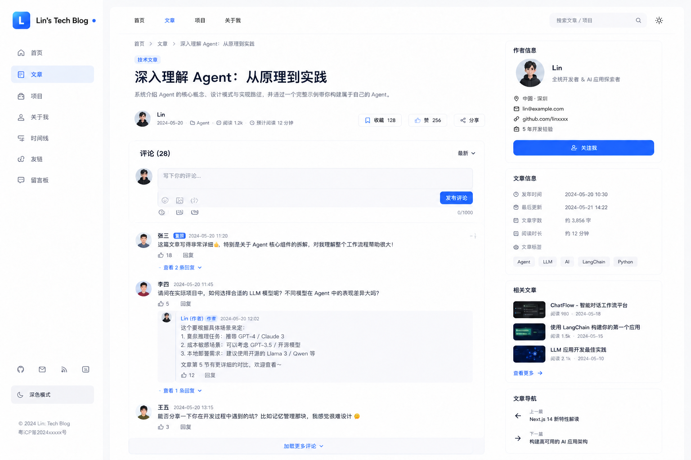
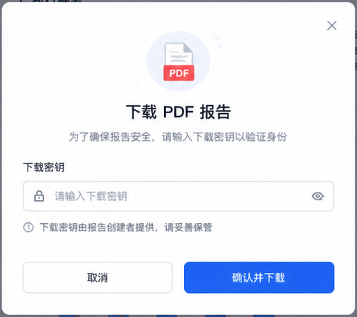
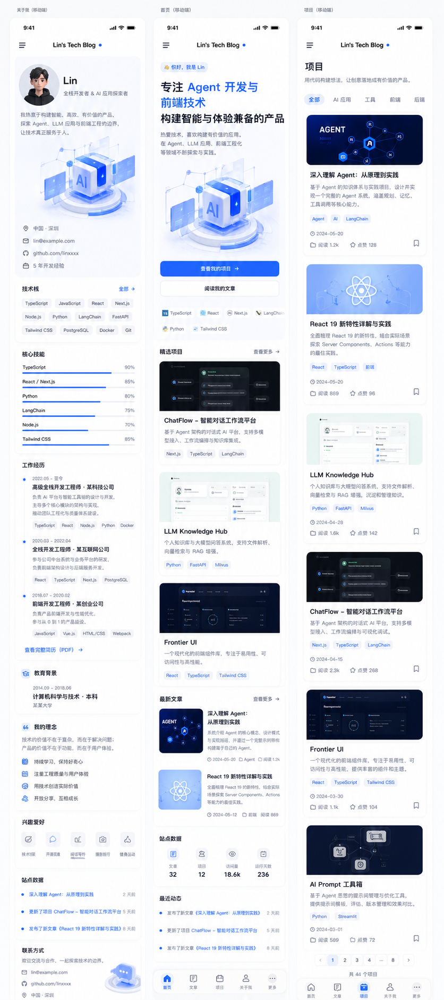
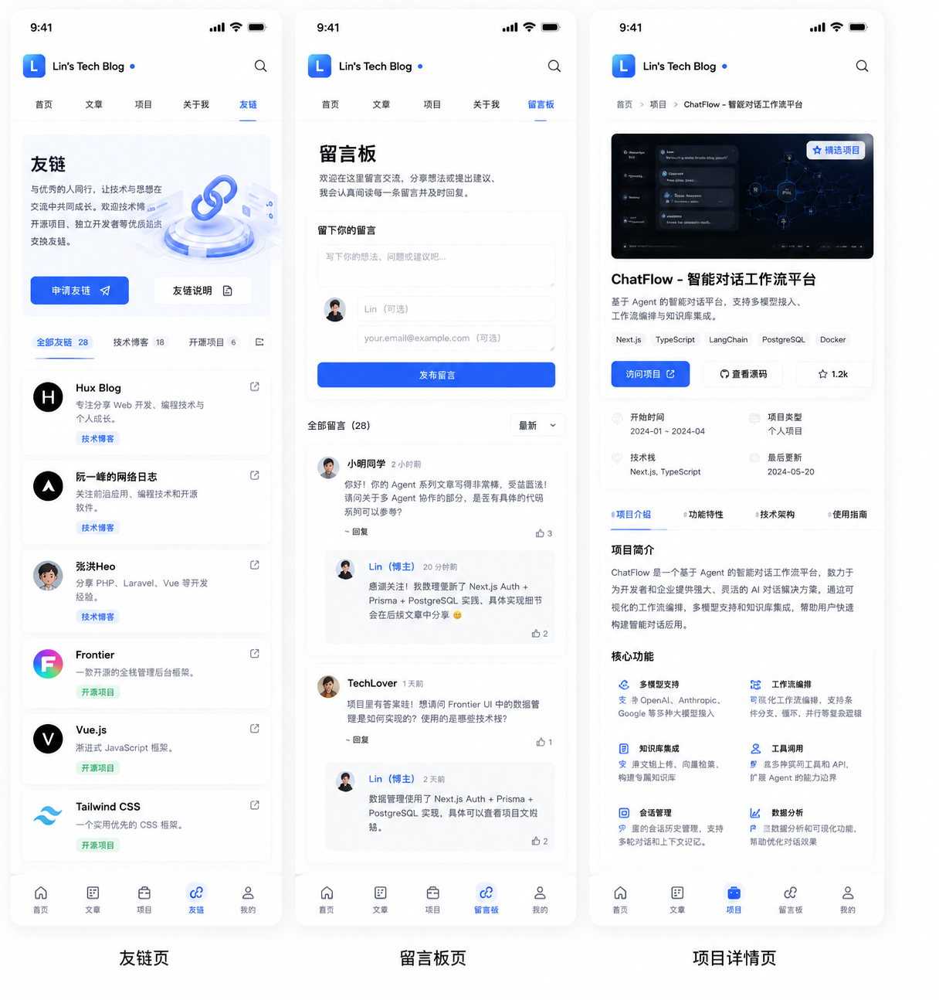
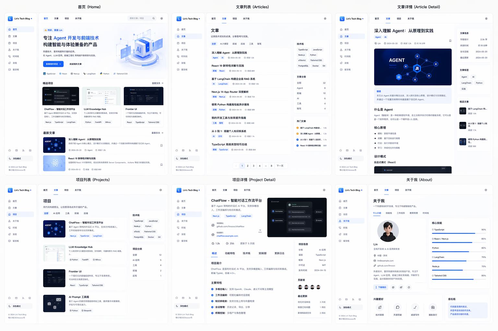

# Lin's Tech Blog - 林氏科技博客


一个现代化的个人技术博客网站，基于 Vue 3 + Vite + Tailwind CSS 构建。

## 🌟 项目介绍

Lin's Tech Blog 是一个专注于 Agent 开发与前端技术的个人技术博客平台，展示作者的技术文章、项目作品和个人信息。

## 📌 项目进展

本博客目前处于未完善阶段，欢迎社区成员根据现有设计图继续参与开发完善。

## ✨ 核心功能

### 已实现功能

| 功能模块 | 描述 | 状态 |
| :--- | :--- | :--- |
| **首页展示** | Hero 首屏区、精选项目、最新文章、技术栈展示、站点数据统计 | ✅ 已完成 |
| **文章管理** | 文章列表、文章详情、分类筛选、阅读统计 | ✅ 已完成 |
| **项目展示** | 项目卡片、项目详情、技术标签 | ✅ 已完成 |
| **关于页面** | 个人简介、技术栈、联系方式 | ✅ 已完成 |
| **友链系统** | 友情链接展示、申请提交 | ✅ 已完成 |
| **留言板** | 用户留言、评论互动 | ✅ 已完成 |
| **响应式设计** | 桌面端侧边栏、移动端底部导航 | ✅ 已完成 |
| **深色模式** | 主题切换功能 | ✅ 已完成 |
| **PDF下载** | 简历下载弹窗 | ✅ 已完成 |

## 🛠️ 技术栈

### 前端框架
- **Vue 3** - 渐进式 JavaScript 框架
- **Vue Router** - Vue 官方路由管理器
- **Vite** - 下一代前端构建工具

### 样式与布局
- **Tailwind CSS 3** - 实用优先的 CSS 框架

### 开发工具
- **TypeScript** - 类型安全的 JavaScript
- **PostCSS** - CSS 处理工具

## 📁 项目结构

```
frontend/
├── public/                # 静态资源目录
│   ├── icons/            # 图标资源
│   ├── images/           # 图片资源
│   ├── ui/               # UI设计图
│   └── favicon.svg       # 网站图标
├── src/                  # 源代码目录
│   ├── components/       # 公共组件
│   │   ├── AuthModal.vue        # 登录/注册弹窗
│   │   └── PdfDownloadModal.vue # PDF下载弹窗
│   ├── composables/      # 组合式函数
│   │   ├── useAuthModal.ts      # 认证弹窗逻辑
│   │   └── usePdfModal.ts       # PDF弹窗逻辑
│   ├── router/           # 路由配置
│   │   └── index.js      # 路由定义
│   ├── views/            # 页面视图
│   │   ├── HomeView.vue         # 首页
│   │   ├── ArticlesView.vue     # 文章列表
│   │   ├── ArticleDetailView.vue # 文章详情
│   │   ├── ProjectsView.vue     # 项目列表
│   │   ├── ProjectDetailView.vue # 项目详情
│   │   ├── AboutView.vue        # 关于页面
│   │   ├── LinksView.vue        # 友链页面
│   │   └── LeaveMessageView.vue # 留言页面
│   ├── App.vue           # 根组件
│   ├── main.js           # 入口文件
│   └── style.css         # 全局样式
├── .gitignore            # Git忽略配置
├── index.html            # HTML模板
├── package.json          # 项目依赖配置
├── postcss.config.js     # PostCSS配置
├── tailwind.config.js    # Tailwind配置
└── vite.config.js        # Vite配置
```

## 🚀 安装步骤

### 环境要求

- **Node.js** >= 18.0.0
- **npm** >= 9.0.0

### 安装依赖

```bash
# 安装项目依赖
npm install
```

### 开发模式

```bash
# 启动开发服务器
npm run dev
```

访问 `http://localhost:5173` 查看项目。

### 生产构建

```bash
# 构建生产版本
npm run build

# 预览生产构建
npm run preview
```

## 📖 使用方法

### 页面导航

1. **首页** (`/`) - 展示个人简介、精选项目、最新文章
2. **文章** (`/articles`) - 浏览所有文章列表
3. **文章详情** (`/article/:id`) - 查看文章详细内容
4. **项目** (`/projects`) - 浏览所有项目列表
5. **项目详情** (`/project/:id`) - 查看项目详细信息
6. **关于** (`/about`) - 了解作者信息
7. **友链** (`/links`) - 查看友情链接
8. **留言** (`/messages`) - 发表留言评论

### 功能使用

- **下载简历**: 点击首页个人卡片中的"下载简历(PDF)"按钮
- **切换主题**: 点击侧边栏底部的"深色模式"按钮
- **搜索功能**: 使用顶部导航栏的搜索框搜索文章/项目

## 📱 页面设计图

### 整体设计


### 页面详情

| 页面 | 设计图 |
| :--- | :--- |
| **登录与注册** |  |
| **忘记密码与验证码登录** |  |
| **文章详情页** |  |
| **项目列表** |  |
| **项目详情页** |  |
| **友链** |  |
| **友链提交** |  |
| **留言板** |  |
| **评论区** |  |
| **关于我** |  |
| **简历弹窗** |  |
| **移动端设计** |  |
| **移动端设计(横屏)** |  |
| **完整UI设计** |  |

## 🔧 常见问题

### Q1: 构建失败，提示缺少依赖？

**解决方案**:
```bash
# 删除 node_modules 和 lock 文件
rm -rf node_modules package-lock.json

# 重新安装依赖
npm install
```

### Q2: 开发服务器启动后页面空白？

**解决方案**:
1. 检查控制台是否有报错信息
2. 确保 `vite.config.js` 配置正确
3. 尝试清除浏览器缓存后重新加载

### Q3: 图片资源无法加载？

**解决方案**:
- 确保图片路径正确，使用 `/public/` 目录下的绝对路径
- 检查图片文件是否存在于对应目录

### Q4: CORS 跨域错误？

**解决方案**:
- 项目中使用的外部图片链接已替换为支持 CORS 的图片服务
- 如果需要添加新的外部图片，请确保目标服务器配置了正确的 CORS 头

## 💖 支持与赞助

如果 dameng 帮助你做了能赚钱的事情，并且你也愿意，我非常希望你能考虑赞助我的开源工作。


## 💬 加入交流群

扫描下方二维码加入Superpowers微信交流群，与开发者和用户共同交流


## 📄 许可证

MIT License

## 🤝 贡献

欢迎提交 Issue 和 Pull Request！

## 📧 联系方式

- 微信: JiShu0724
