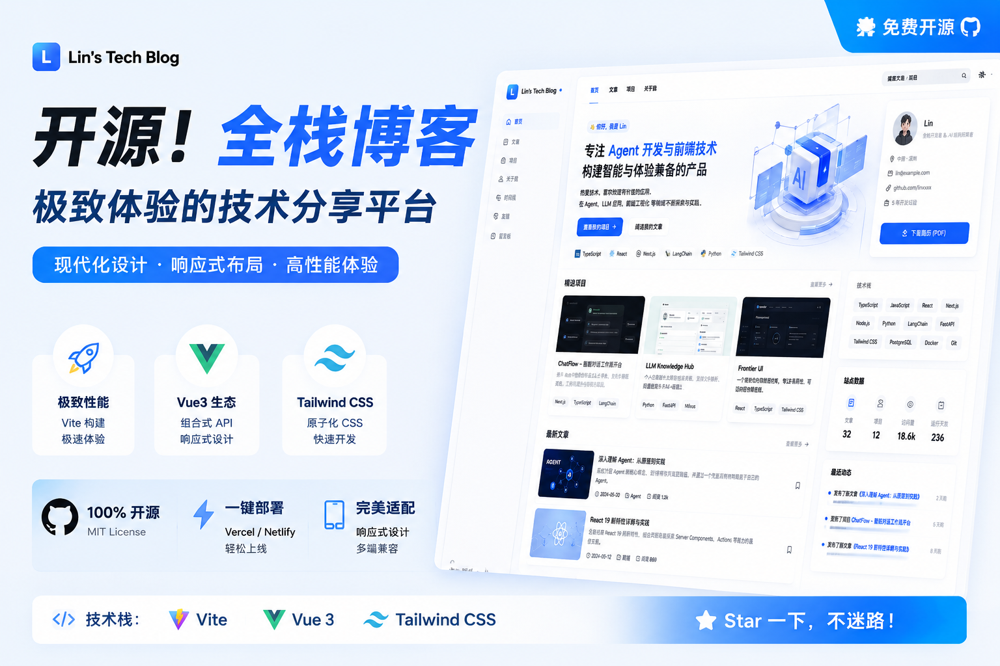
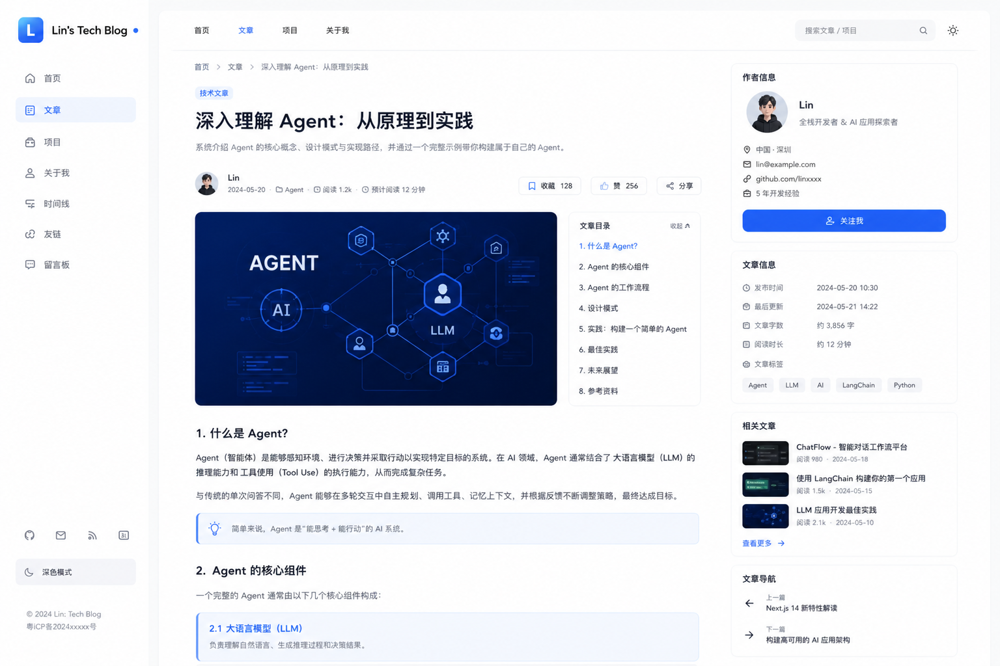
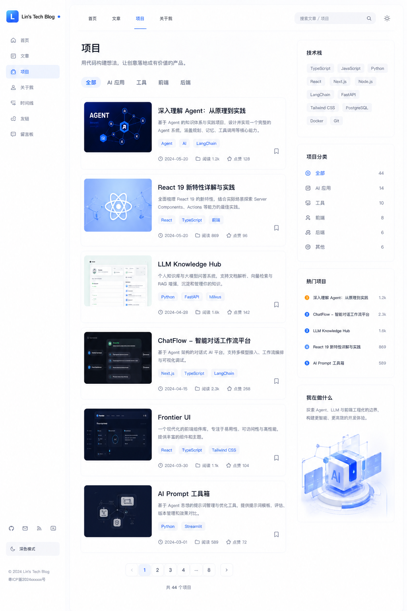
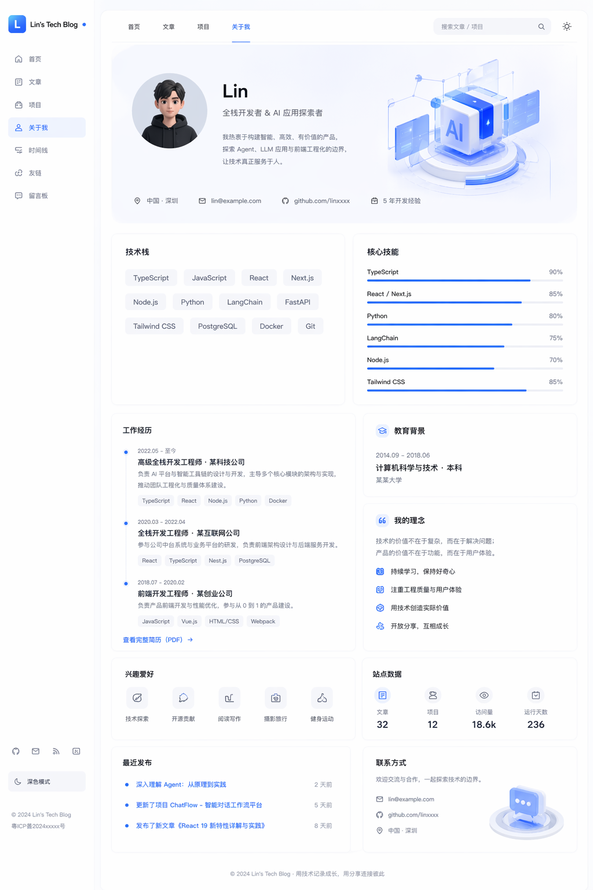
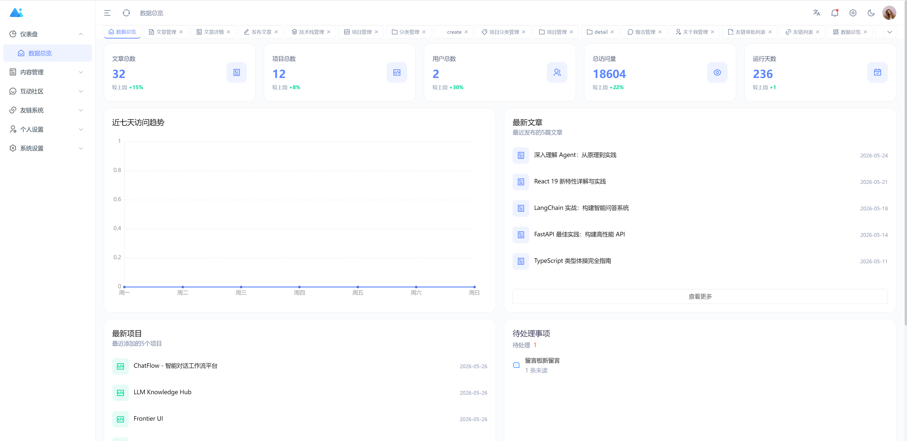
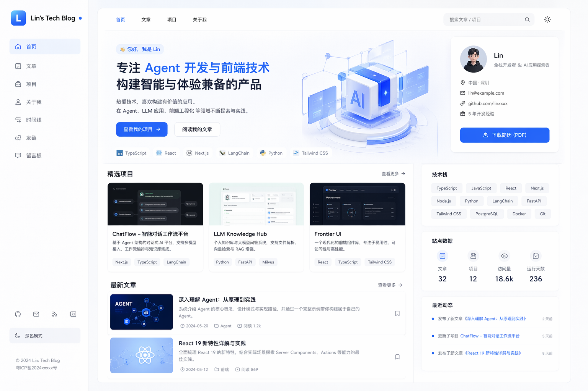
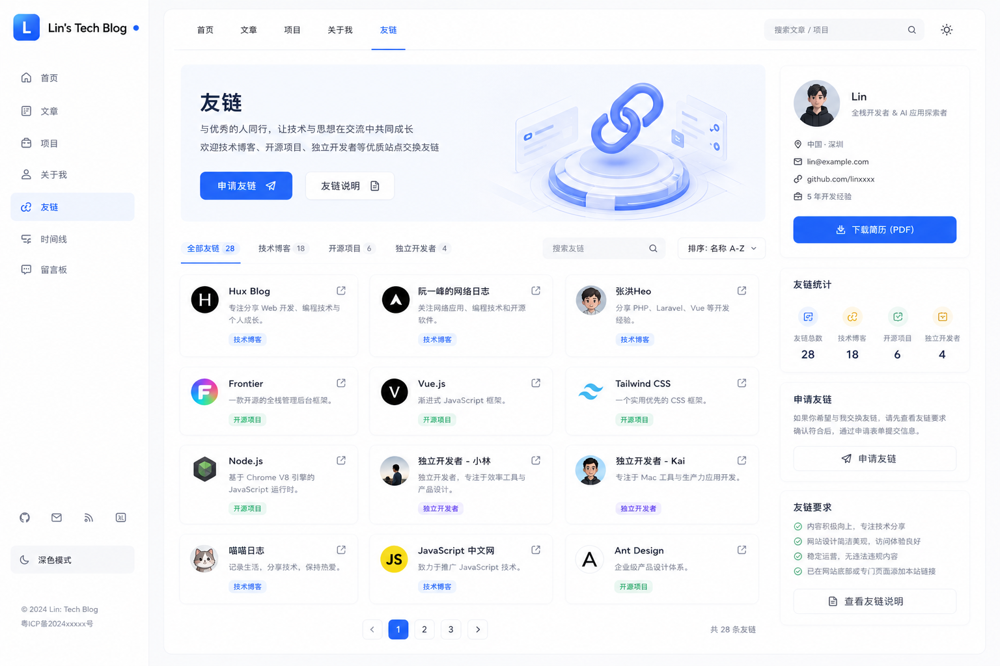

# Lin's Tech Blog - 林氏科技博客



一个现代化的全栈技术博客系统，包含前台博客展示、后台管理面板和 RESTful API 后端服务。


## 🌟 项目介绍

Lin's Tech Blog 是一套完整的博客解决方案，包含三个独立模块：

| 模块 | 端口 | 描述 |
|------|------|------|
| **前台博客** | 5173 | 面向访客的博客展示页面，支持文章浏览、项目展示、友链、留言板等 |
| **后台管理** | 3006 | 管理员控制台，支持内容管理、数据监控、系统设置等。基于 [Art Design Pro](https://github.com/art-design-pro/art-design-pro) 框架构建 |
| **后端 API** | 8000 | FastAPI 构建的 RESTful API，提供数据接口和业务逻辑 |

## ✨ 功能亮点

### 前台博客

| 功能模块 | 描述 |
|----------|------|
| **首页展示** | Hero 首屏区、精选项目、最新文章、技术栈展示、站点数据统计 |
| **文章系统** | 文章列表、文章详情、分类筛选、阅读统计、封面图展示 |
| **项目展示** | 项目卡片、项目详情、技术标签、GitHub 链接 |
| **关于页面** | 个人简介、技能雷达图、工作经历、教育背景、兴趣爱好 |
| **友链系统** | 友情链接展示、分类筛选、申请提交、审核流程 |
| **留言板** | 用户留言、评论互动、分页浏览 |
| **响应式设计** | 桌面端侧边栏 + 移动端自适应布局 |
| **深色模式** | 一键切换亮色/暗色主题 |
| **PDF 简历下载** | 一键下载个人简历 PDF |

### 后台管理系统

| 功能模块 | 描述 |
|----------|------|
| **仪表盘** | 数据统计卡片、访问趋势图表、最新文章/项目、快捷操作、待处理事项 |
| **内容管理** | 文章管理（增删改查）、分类管理、技术栈管理、项目管理 |
| **互动社区** | 评论管理、留言板管理、用户管理 |
| **友链系统** | 友链列表、友链审批 |
| **个人设置** | 个人信息修改、简历管理、PDF 密钥管理 |
| **系统设置** | 站点配置、SEO 设置、关于我管理 |

## 🛠️ 技术栈

### 前端（前台博客）

- **Vue 3** - 渐进式 JavaScript 框架
- **Vue Router 4** - 路由管理
- **Vite 8** - 下一代前端构建工具
- **Tailwind CSS 3** - 实用优先的 CSS 框架
- **Axios** - HTTP 请求库

### 前端（后台管理）

- **Art Design Pro** - [GitHub 开源框架](https://github.com/art-design-pro/art-design-pro)
- **Vue 3 + TypeScript** - 类型安全的开发体验
- **Vite 7** - 快速开发服务器
- **Element Plus** - 企业级 UI 组件库
- **Pinia** - Vue 官方状态管理
- **Vue Router 4** - 路由管理
- **ECharts** - 数据可视化图表
- **WangEditor** - 富文本编辑器
- **Tailwind CSS 4** - 实用优先的 CSS 框架
- **Axios** - HTTP 请求库

### 后端 API

- **FastAPI** - 现代高性能 Python Web 框架
- **Uvicorn** - ASGI 服务器
- **SQLAlchemy 2.0** - ORM 数据库操作
- **MySQL** - 关系型数据库
- **Redis** - 缓存中间件
- **Pydantic** - 数据验证
- **Passlib** - 密码加密
- **JWT** - 身份认证

## 📁 项目结构

```
lin-tech-blog/
├── frontend/              # 前台博客（访客端）
│   ├── public/            # 静态资源
│   └── src/               # 源代码
├── admin/                 # 后台管理系统（管理端）
│   ├── public/            # 静态资源
│   ── src/               # 源代码
├── backend/               # 后端 API 服务
│   ├── scripts/           # 数据脚本
│   ── src/app/           # 应用代码
│       ├── api/           # API 路由
│       ├── core/          # 核心配置
│       ├── crud/          # 数据操作
│       ├── models/        # 数据模型
│       ├── schemas/       # 数据验证
│       ├── security/      # 安全模块
│       └── services/      # 业务服务
├── screenshots/           # 项目截图
└── .gitignore             # Git 忽略配置
```

## 🚀 快速开始

### 环境要求

- **Python** >= 3.10
- **Node.js** >= 18
- **pnpm** >= 8
- **MySQL** >= 5.7
- **Redis** (可选)

### 1. 后端服务

```bash
# 进入后端目录
cd backend

# 安装依赖
pip install -r requirements.txt

# 配置环境变量
cp .env.example .env
# 编辑 .env，设置数据库连接等信息

# 启动服务
python start.py
```

后端服务运行在 `http://localhost:8000`，API 文档访问 `http://localhost:8000/docs`

### 2. 前台博客

```bash
# 进入前台目录
cd frontend

# 安装依赖
pnpm install

# 启动开发服务器
pnpm dev
```

前台服务运行在 `http://localhost:5173`

### 3. 后台管理

```bash
# 进入后台目录
cd admin

# 安装依赖
pnpm install

# 启动开发服务器
pnpm dev
```

后台服务运行在 `http://localhost:3006`

### 默认管理员账号

- **用户名**: admin
- **密码**: 123456

## � 数据初始化

项目包含演示数据填充脚本，首次运行可快速体验：

```bash
cd backend
python scripts/seed_demo_data.py
```

脚本会自动创建演示用户、文章、项目、友链等数据。

## 📸 项目截图

### 前台博客

| 页面 | 截图 |
|------|------|
| 首页 |  |
| 文章列表 |  |
| 项目展示 |  |
| 关于我 |  |
| 友链 |  |

### 后台管理

| 页面 | 截图 |
|------|------|
| 仪表盘 |  |
| 文章管理 |  |
| 项目管理 |  |
| 友链管理 |  |

## 🔧 常见问题

### Q1: 数据库连接失败？

确保 MySQL 服务已启动，并检查 `backend/.env` 中的数据库配置是否正确。

### Q2: 端口被占用？

修改各服务的启动端口：
- 前端: `frontend/vite.config.js`
- 后台: `admin/.env` 或启动命令中指定
- 后端: `backend/.env` 中修改

### Q3: 图片无法显示？

项目使用本地 SVG 占位图作为封面图，无需额外配置。如需使用外部图片，请确保图片源可访问。

## 💖 支持与赞助

如果这个项目对你有帮助，欢迎赞助支持我的开源工作。


## 💬 加入交流群

扫描下方二维码加入微信交流群，与开发者和用户共同交流。


## 📄 许可证

MIT License

## 🤝 贡献

欢迎提交 Issue 和 Pull Request！

## 📧 联系方式

- 微信: JiShu0724
- GitHub: [dameng2026](https://github.com/dameng2026)
